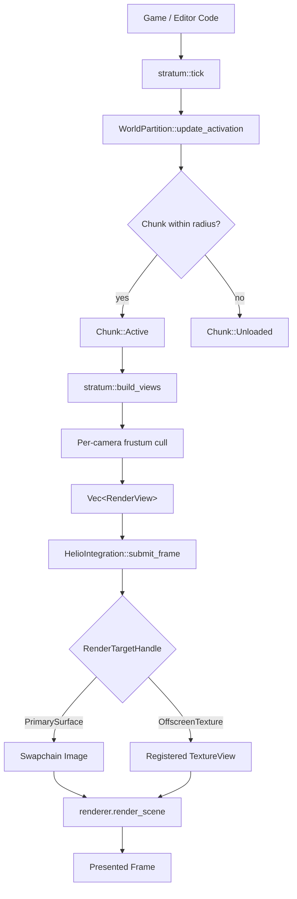
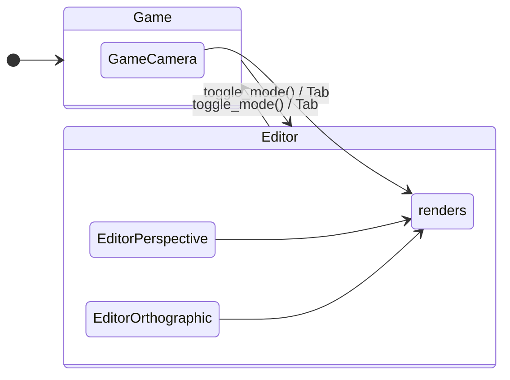
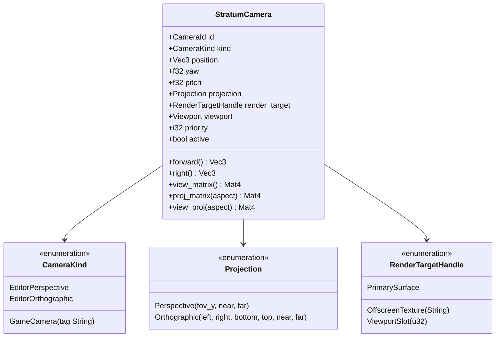
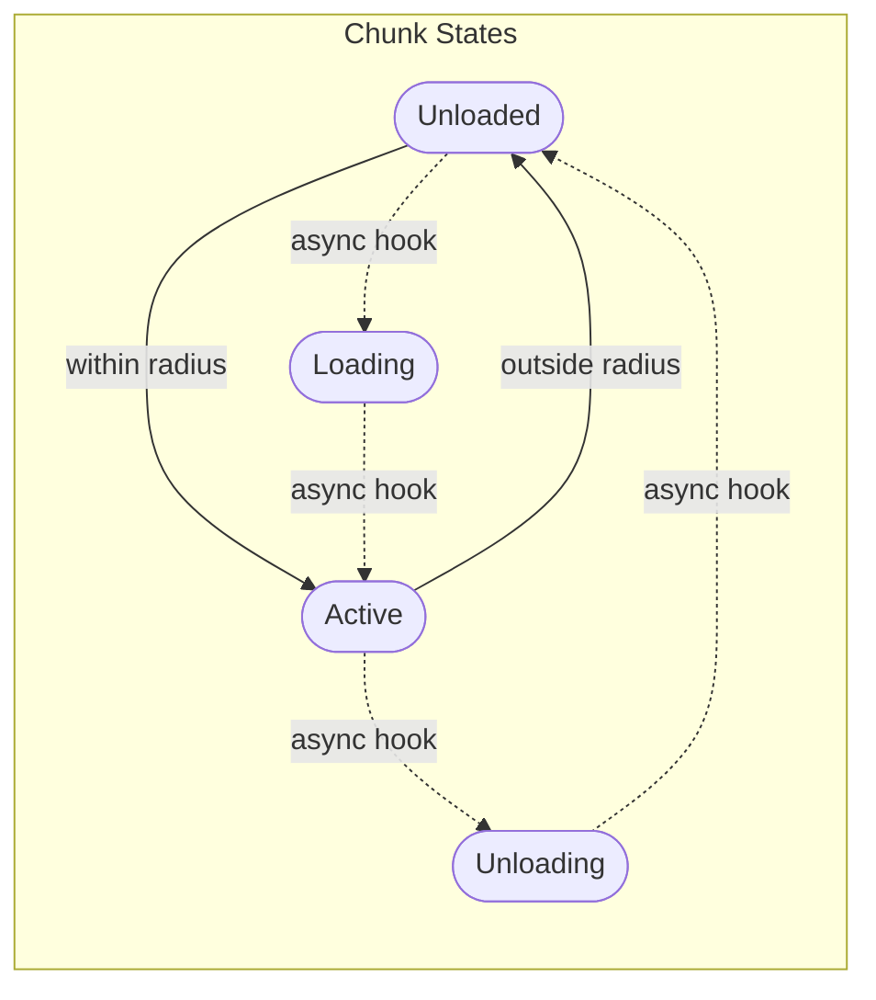
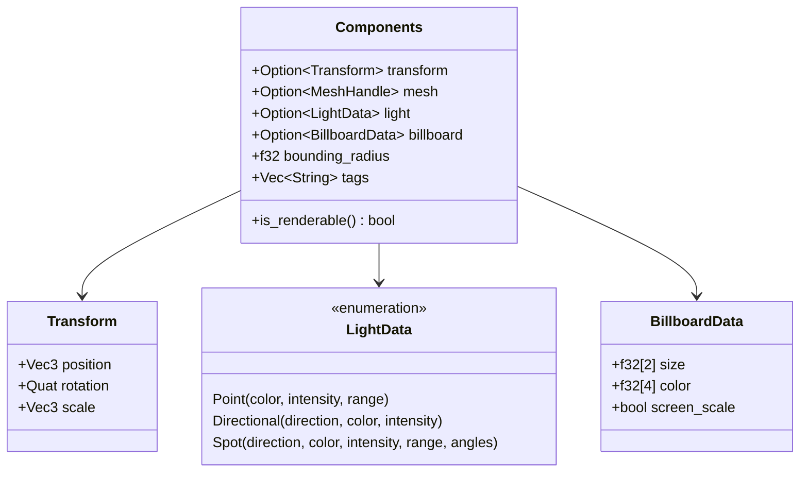
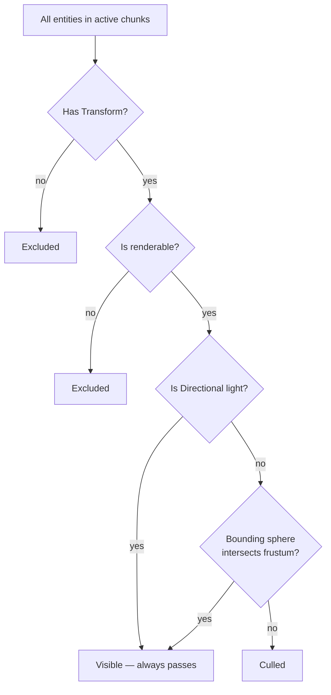
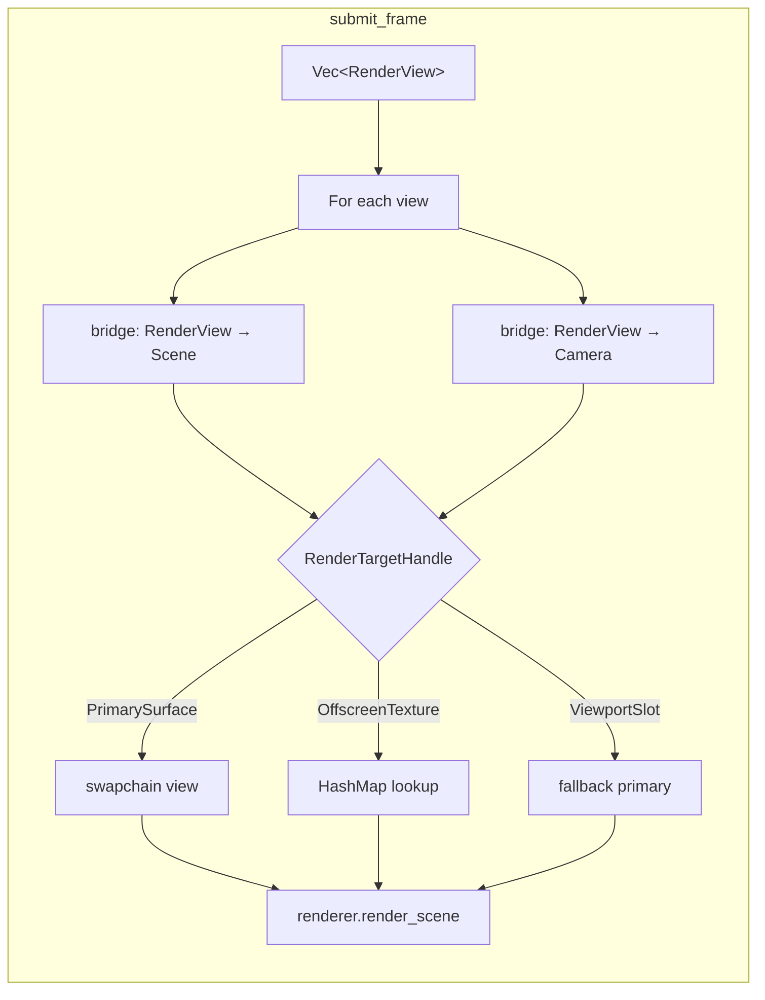
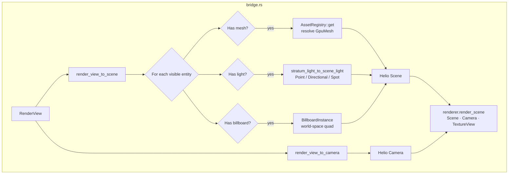
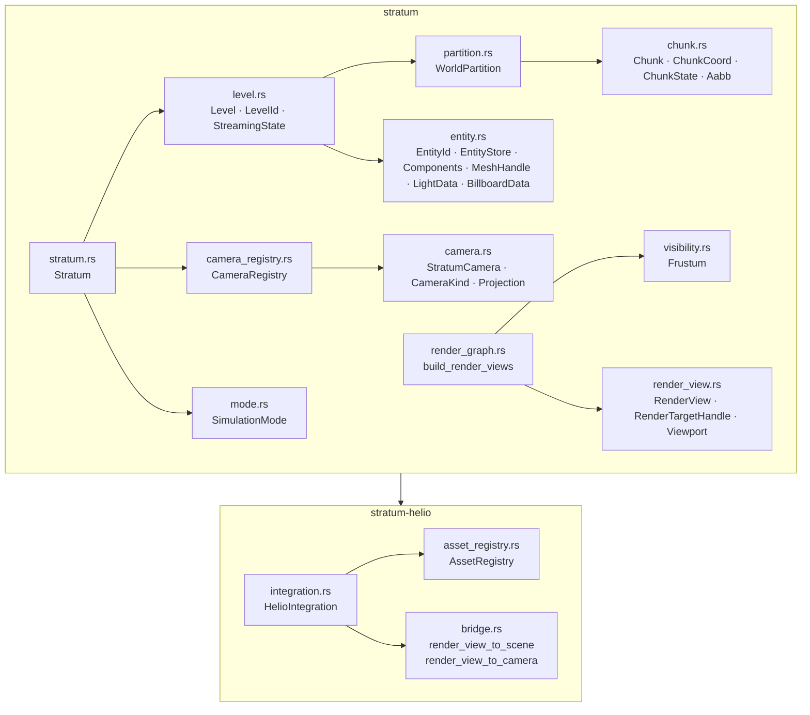

<div align="center">

<br/>

<picture>
  
</picture>

### World Orchestration for the Pulsar Engine

*Levels · Spatial Streaming · Cameras · Simulation Modes*

<br/>

[](https://www.rust-lang.org/)
[](LICENSE)
[](crates/stratum/src)
[](crates/stratum/src)

<br/>

[Overview](#overview) · [Architecture](#architecture) · [Core Concepts](#core-concepts) · [Cameras](#camera-system) · [Streaming](#world-streaming) · [Rendering](#rendering-pipeline) · [Integration](#stratum-helio-integration) · [Examples](#examples) · [Building](#building) · [Reference](#reference)

<br/>

</div>

Textures for Voxel demo from https://faithfulpack.net 64x Java. Thanks guys you are the best!!

---

## Overview

Stratum is the world layer that sits between your game or editor code and the [Helio](https://github.com/Far-Beyond-Pulsar/Helio) renderer. It owns levels, entities, cameras, world streaming, frustum culling, and simulation modes — none of it touches a GPU type.

The only GPU code lives in `stratum-helio`, a thin bridge crate that translates Stratum's plain-data output into Helio API calls. Helio never receives a `Level`, `Camera`, or `Entity`. Stratum never receives a `wgpu::Buffer`, `TextureView`, or `GpuMesh`.

```
  Your game / editor code
         │
         ▼
  ┌─────────────────────────────────────────────────┐
  │  stratum                 (zero GPU deps)        │
  │  ├── Stratum             top-level orchestrator │
  │  ├── Level               entities + partition   │
  │  ├── WorldPartition      spatial streaming grid │
  │  ├── CameraRegistry      all cameras, all modes │
  │  ├── Frustum             visibility culling     │
  │  └── SimulationMode      Editor ↔ Game          │
  └────────────────────────┬────────────────────────┘
          Vec<RenderView>  │  plain data, no GPU
                           ▼
  ┌─────────────────────────────────────────────────┐
  │  stratum-helio           integration bridge     │
  │  ├── AssetRegistry       MeshHandle → GpuMesh   │
  │  ├── bridge              Stratum → Helio types  │
  │  └── HelioIntegration    submit_frame()         │
  └────────────────────────┬────────────────────────┘
                           ▼
                     Helio Renderer
               (Scene + Camera + TextureView)
```

---

## Architecture

### Crates

| Crate | Description | GPU deps |
|---|---|:---:|
| `stratum` | Core world layer | none |
| `stratum-helio` | Integration bridge | wgpu, Helio |
| `examples` | `stratum_basic`, `stratum_advanced` | wgpu, Helio |

### Data Flow



### One Frame

```rust
// 1. Tick world — streaming activation, simulation clock
stratum.tick(delta_time);

// 2. Produce render views — pure, no side effects
let views: Vec<RenderView> = stratum.build_views(width, height, time);

// 3. Submit to Helio through the bridge
integration.submit_frame(&views, level, &surface_view, delta_time)?;
```

---

## Core Concepts

### Stratum

The top-level orchestrator. Owns all levels, the camera registry, and the current simulation mode.

```rust
let mut stratum = Stratum::new(SimulationMode::Game);

let level_id = stratum.create_level("main", 16.0, 48.0);
//                                           ↑       ↑
//                                     chunk_size  activation_radius (metres)

let cam_id = stratum.register_camera(StratumCamera { ... });

stratum.tick(dt);
let views = stratum.build_views(1280, 720, time);
```

### Simulation Mode

Hot-switchable at any point. Determines which cameras produce render views.

```rust
stratum.set_mode(SimulationMode::Editor);
stratum.toggle_mode(); // Editor → Game
```



---

## Camera System

Cameras are **world-level**, not level-local. They survive level loads and unloads, and each can independently target any render target.



### Camera Visibility by Mode

| Kind | Editor | Game |
|---|:---:|:---:|
| `EditorPerspective` | renders | — |
| `EditorOrthographic` | renders | — |
| `GameCamera` | — | renders |

### Viewport

Normalized `0..1` rectangles within a render target. No GPU code required.

```rust
Viewport::full()          // 0,0 → 1,1      full screen
Viewport::left_half()     // 0,0 → 0.5,1    split-screen left
Viewport::right_half()    // 0.5,0 → 1,1    split-screen right
Viewport::top_right(0.3)  // inset PiP      top-right corner
```

### Degenerate Pitch Handling

When pitch is near ±90° (looking straight up or down), the forward vector becomes parallel to the world Y-up vector, degenerating `look_at()`. Stratum automatically switches to Z as the screen-space up vector in this case — the top-down multiview camera works without any special casing from the caller.

---

## World Streaming

### WorldPartition

Grid-based spatial partition. Each chunk is a fixed-size cubic cell. Each frame, `tick()` activates chunks within `activation_radius` of any active camera and evicts the rest.



Solid arrows are the default synchronous transitions. Dashed arrows are `// STREAMING HOOK` callsites — splice in async disk IO without restructuring the partition algorithm.

```rust
// Manual chunk control (small levels / demos)
level.activate_all_chunks();

// Camera-driven activation (streaming worlds)
level.activate_partition_around(&[cam_pos_a, cam_pos_b]);

// Inspect state
for chunk in level.partition().active_chunks() {
    println!("{:?} — {} entities", chunk.coord, chunk.entities.len());
}
```

### Activation Algorithm

The partition computes the desired-active set by iterating a 3D cubic region of half-span `ceil(activation_radius / chunk_size) + 1` around each active camera, then filtering by actual sphere distance. Conservative design ensures no chunk on a streaming boundary is missed.

---

## Entity System

### Components

Stratum uses a flat, explicit component model — a bag of typed optional fields rather than a trait-based ECS. This keeps the API simple and the data layout predictable.



```rust
let id = level.spawn_entity(
    Components::new()
        .with_transform(Transform::from_position(Vec3::new(0.0, 1.0, 0.0)))
        .with_mesh(mesh_handle)
        .with_light(LightData::Point { color: [1.0, 0.8, 0.3], intensity: 5.0, range: 8.0 })
        .with_bounding_radius(2.5)
        .with_tag("zone_a")
);
```

An entity is **renderable** if it has a mesh, a light, or a billboard. Non-renderable entities exist in the world but are excluded from render views.

### Bounding Radius Priority

Frustum culling uses the first of:
1. Explicit `bounding_radius` on `Components`
2. Light range (for entities with no mesh)
3. 50 m conservative fallback

Directional lights bypass culling entirely — they illuminate the whole scene regardless of camera position.

---

## Rendering Pipeline

### Frustum Culling

Stratum uses the **Gribb/Hartmann** method to extract 6 frustum planes directly from the view-projection matrix. Planes are normalized after extraction. Entities are tested with a sphere-plane intersection for robustness at boundaries.



### Render View

The contract between Stratum and the renderer. Pure data — no GPU handles.

```rust
pub struct RenderView {
    pub camera_id:        CameraId,
    pub view_proj:        Mat4,
    pub camera_position:  Vec3,
    pub time:             f32,
    pub render_target:    RenderTargetHandle,
    pub viewport:         Viewport,
    pub visible_entities: Vec<EntityId>,
    pub priority:         i32,   // lower renders first
}
```

---

## stratum-helio Integration

### AssetRegistry

Maps `MeshHandle → GpuMesh`. Populated once at startup. The host application retains ownership.

```rust
let mut assets = AssetRegistry::new();
let h = assets.add(GpuMesh::cube(&device, [0.0, 0.5, 0.0], 0.5));
//  h: MeshHandle — opaque u64, safe to store in Components
```

Two-step registration is also available for pre-allocated handles:

```rust
let handle = AssetRegistry::alloc_handle();
// ... load GpuMesh asynchronously ...
assets.register(handle, gpu_mesh);
```

### HelioIntegration



```rust
let mut integration = HelioIntegration::new(renderer, assets);

// Each frame
integration.submit_frame(&views, level, &surface_view, dt)?;

// Register offscreen render targets for multiview / portals / reflections
integration.register_offscreen_view("reflection", texture_view);
integration.unregister_offscreen_view("reflection");
```

### Bridge Translation



---

## Examples

### `stratum_basic`

Feature-parity with `render_v2_basic`: three lit cubes, a ground plane, three point lights. Demonstrates the full Stratum → `stratum-helio` → Helio pipeline.

### `stratum_advanced`

4-zone streaming world (City · Factory · Forest · Void) with 12 animated orbiting lights per zone, world partition streaming, billboard halos, and a directional sun. Fly between zones to watch chunk activation and eviction in real time (F3 prints stats).

### Controls

| Key | Action |
|---|---|
| `WASD` | Fly camera |
| `Space` / `LShift` | Move up / down |
| `Mouse drag` | Look (click window to grab cursor) |
| `Tab` | Toggle Editor ↔ Game mode |
| `1` / `2` | Single fullscreen view / 4-up multiview |
| `F1` / `F2` | Main camera / top-down overview *(advanced only)* |
| `F3` | Print partition debug stats *(advanced only)* |
| `Escape` | Release cursor or exit |

### 4-Up Multiview (press `2`)

Both demos support a 4-up split-screen layout driven by offscreen textures and a custom blit pipeline.

```
  ┌──────────────┬──────────────┐
  │  Freelook    │  Top-down    │
  │  (main cam)  │  orthographic│
  ├──────────────┼──────────────┤
  │  Side        │  Front       │
  │  orthographic│  orthographic│
  └──────────────┴──────────────┘
```

All four views share the main camera's world position. The three orthographic cameras never rotate — only the freelook camera is interactive.

---

## Building

### Prerequisites

- Rust stable (2021 edition)
- GPU with **hardware ray-tracing** support (Vulkan ray query / DX12 DXR)
- [Helio](https://github.com/Far-Beyond-Pulsar/Helio) checked out as a sibling:

```
genesis/
├── Helio/      ← renderer
└── Stratum/    ← this repo
```

The workspace references Helio via a relative path:

```toml
helio-render-v2 = { path = "../../Helio/crates/helio-render-v2" }
```

### Commands

```sh
# Full workspace build
cargo build --workspace

# Basic demo
cargo run -p examples --example stratum_basic

# Advanced 4-zone streaming demo
cargo run -p examples --example stratum_advanced

# Tests
cargo test --workspace

# Fast check
cargo check --workspace
```

---

## Reference

### Module Map



### Public API Summary

#### `Stratum`

```rust
Stratum::new(mode) → Self
stratum.mode() → SimulationMode
stratum.set_mode(mode)
stratum.toggle_mode()
stratum.create_level(name, chunk_size, activation_radius) → LevelId
stratum.set_active_level(id) → bool
stratum.active_level() → Option<&Level>
stratum.active_level_mut() → Option<&mut Level>
stratum.register_camera(camera) → CameraId
stratum.unregister_camera(id) → Option<StratumCamera>
stratum.cameras() → &CameraRegistry
stratum.cameras_mut() → &mut CameraRegistry
stratum.tick(delta_time)
stratum.build_views(width, height, time) → Vec<RenderView>
stratum.simulation_time() → f32
```

#### `Level`

```rust
level.spawn_entity(components) → EntityId
level.despawn_entity(id) → Option<Components>
level.activate_all_chunks()
level.activate_partition_around(positions: &[Vec3])
level.entities() → &EntityStore
level.entities_mut() → &mut EntityStore
level.partition() → &WorldPartition
level.streaming_state() → StreamingState
level.set_streaming_state(state)
```

#### `EntityStore`

```rust
store.spawn(components) → EntityId
store.despawn(id) → Option<Components>
store.get(id) → Option<&Components>
store.get_mut(id) → Option<&mut Components>
store.iter() → impl Iterator<Item = (EntityId, &Components)>
store.len() → usize
```

#### `WorldPartition`

```rust
partition.chunks() → impl Iterator<Item = &Chunk>
partition.active_chunks() → impl Iterator<Item = &Chunk>
partition.active_entities() → Vec<EntityId>
partition.place_entity(id, world_pos)
partition.remove_entity(id, world_pos)
partition.update_activation(camera_positions: &[Vec3])
partition.activate_all()
partition.coord_for(pos) → ChunkCoord
```

#### `CameraRegistry`

```rust
registry.register(camera) → CameraId
registry.unregister(id) → Option<StratumCamera>
registry.get(id) → Option<&StratumCamera>
registry.get_mut(id) → Option<&mut StratumCamera>
registry.iter() → impl Iterator<Item = (CameraId, &StratumCamera)>
registry.active_cameras() → impl Iterator
registry.editor_cameras() → impl Iterator
registry.game_cameras() → impl Iterator
```

#### `Frustum`

```rust
Frustum::from_view_proj(vp: &Mat4) → Self
frustum.contains_point(pos: Vec3) → bool
frustum.intersects_sphere(center: Vec3, radius: f32) → bool
```

#### `HelioIntegration`

```rust
HelioIntegration::new(renderer, assets) → Self
integration.submit_frame(&views, level, &surface_view, dt) → Result<()>
integration.register_offscreen_view(name, view)
integration.unregister_offscreen_view(name)
integration.resize(width, height)
integration.renderer() → &Renderer
integration.renderer_mut() → &mut Renderer
integration.assets() → &AssetRegistry
integration.assets_mut() → &mut AssetRegistry
```

---

## Design Principles

1. **Zero GPU in `stratum`** — no `wgpu`, no `Arc<Buffer>`, no GPU handles. GPU ownership lives entirely in `stratum-helio`.
2. **Cameras are world-level** — not level-local; survive level transitions and additive loading cleanly.
3. **`build_views` is pure** — reads state, produces output, no mutations, no side effects.
4. **Explicit streaming hooks** — every chunk state transition is a labelled `// STREAMING HOOK` callsite ready to drive async IO without restructuring anything.
5. **No global mutable state** — all state is owned by `Stratum` instances. Multiple independent worlds can coexist in the same process.
6. **Async-ready, sync by default** — `Loading` and `Unloading` chunk states exist and are respected by the query API, but transitions are immediate in the default implementation. Opt into async without changing the partition algorithm.
7. **Zero unsafe** — the entire codebase is safe Rust.

---

## License

See [LICENSE](LICENSE).


---

Stratum sits between your game/editor code and the [Helio](https://github.com/Far-Beyond-Pulsar/Helio) renderer. It manages levels, spatial streaming, cameras, and render view production — the entire crate has **zero GPU dependencies**.

```
  Game / Editor code
        │
        ▼
  ┌─────────────────────────────────────────────────┐
  │  Stratum                                        │
  │  ├── Level       entities + spatial partition   │
  │  ├── Cameras     editor + game, all modes       │
  │  └── Mode        Editor | Game (hot-switchable) │
  └────────────────────────┬────────────────────────┘
          Vec<RenderView>  │  (plain data — no GPU handles)
                           ▼
  ┌─────────────────────────────────────────────────┐
  │  stratum-helio   integration bridge             │
  │  ├── AssetRegistry   MeshHandle → GpuMesh       │
  │  └── HelioIntegration  submit_frame()           │
  └────────────────────────┬────────────────────────┘
                           ▼
                     Helio Renderer
               (knows nothing about Levels)
```

## Crates

| Crate | Description |
|---|---|
| `stratum` | Core world layer — zero GPU dependencies |
| `stratum-helio` | Thin integration bridge between Stratum and Helio |
| `examples` | `stratum_basic` and `stratum_advanced` demos |

---

## Architecture

### Hard GPU Boundary

`stratum` has **zero** wgpu/Helio imports. Entities reference meshes via opaque `MeshHandle(u64)` handles resolved at render-time by the `AssetRegistry` in `stratum-helio`. Helio never receives a `Level`, `Entity`, or `Camera` type — only `Scene`, `Camera`, and `wgpu::TextureView`.

### One Frame

```rust
// 1. Advance world state (partition activation, simulation clock)
stratum.tick(delta_time);

// 2. Produce render views — pure, no side effects
let views: Vec<RenderView> = stratum.build_views(width, height, time);

// 3. Translate and submit to Helio
integration.submit_frame(&views, level, &surface_view, delta_time)?;
```

`build_views` runs per-camera frustum culling against the active world partition and returns a priority-sorted list of `RenderView`s.

---

## Core Concepts

### Stratum

Top-level orchestrator. Owns all `Level`s, the `CameraRegistry`, and the current `SimulationMode`.

```rust
let mut stratum = Stratum::new(SimulationMode::Game);
let level_id = stratum.create_level("main", 16.0, 48.0); // chunk_size, activation_radius
let cam_id   = stratum.register_camera(StratumCamera { ... });
stratum.tick(dt);
let views = stratum.build_views(1280, 720, time);
```

### Level

A structured world container. Owns entities and the world partition.

```rust
let level = stratum.level_mut(level_id).unwrap();

let id = level.spawn_entity(
    Components::new()
        .with_transform(Transform::from_position(Vec3::new(0.0, 1.0, 0.0)))
        .with_mesh(mesh_handle)
        .with_light(LightData::Point { color: [1.0, 0.8, 0.3], intensity: 5.0, range: 8.0 })
);

level.activate_all_chunks(); // skip streaming for small levels
```

### WorldPartition

Grid-based spatial streaming. Each frame, chunks within `activation_radius` of any active camera are resident; others are evicted.

```rust
// Driven automatically by stratum.tick() — or manually:
level.activate_partition_around(&[cam_pos_a, cam_pos_b]);
```

Every state transition is marked with a `// STREAMING HOOK` comment — splice in async disk IO without restructuring anything.

### Cameras

Cameras are world-level, not level-local — they survive level loads and unloads.

```rust
// Game camera — renders in SimulationMode::Game
stratum.register_camera(StratumCamera {
    id:            CameraId::PLACEHOLDER,
    kind:          CameraKind::GameCamera { tag: "main".into() },
    position:      Vec3::new(0.0, 3.0, 10.0),
    yaw:           0.0,
    pitch:         -0.2,
    projection:    Projection::perspective(FRAC_PI_4, 0.1, 1000.0),
    render_target: RenderTargetHandle::PrimarySurface,
    viewport:      Viewport::full(),
    priority:      0,
    active:        true,
});
```

Camera visibility by mode:

| Kind | Editor mode | Game mode |
|---|:---:|:---:|
| `EditorPerspective` | renders | — |
| `EditorOrthographic` | renders | — |
| `GameCamera` | — | renders |

### SimulationMode

Hot-switchable at any point.

```rust
stratum.set_mode(SimulationMode::Editor);
stratum.toggle_mode(); // Editor → Game
```

### RenderView

The contract between Stratum and the renderer. Plain data, no GPU handles.

```rust
pub struct RenderView {
    pub camera_id:        CameraId,
    pub view_proj:        Mat4,
    pub camera_position:  Vec3,
    pub time:             f32,
    pub render_target:    RenderTargetHandle,
    pub viewport:         Viewport,
    pub visible_entities: Vec<EntityId>,
    pub priority:         i32,
}
```

### Viewport

Normalized `0..1` rectangle within a render target. Enables split-screen, PiP, and multi-viewport editor layouts with no GPU code.

```rust
Viewport::full()          // 0,0 → 1,1
Viewport::left_half()     // 0,0 → 0.5,1
Viewport::right_half()    // 0.5,0 → 1,1
Viewport::top_right(0.3)  // inset PiP at top-right
```

---

## stratum-helio Integration

### AssetRegistry

Maps `MeshHandle → GpuMesh`. Populated once at startup.

```rust
let mut assets = AssetRegistry::new();
let h = assets.add(GpuMesh::cube(&device, [0.0, 0.5, 0.0], 0.5));
// h: MeshHandle — pass to Components::with_mesh(h)
```

### HelioIntegration

Wraps `Renderer + AssetRegistry`. One call per frame:

```rust
let mut integration = HelioIntegration::new(renderer, assets);
integration.submit_frame(&views, level, &surface_view, dt)?;
```

Internally, for each `RenderView`:
1. Resolves `RenderTargetHandle` → `&wgpu::TextureView`
2. Translates `visible_entities + EntityStore` → Helio `Scene`
3. Translates `RenderView` → Helio `Camera`
4. Calls `renderer.render_scene()`

---

## Multi-Camera Examples

```rust
// Split-screen co-op
stratum.register_camera(StratumCamera {
    kind: CameraKind::GameCamera { tag: "p1".into() },
    viewport: Viewport::left_half(),
    ..
});
stratum.register_camera(StratumCamera {
    kind: CameraKind::GameCamera { tag: "p2".into() },
    viewport: Viewport::right_half(),
    ..
});

// Editor perspective + orthographic minimap
stratum.register_camera(StratumCamera {
    kind: CameraKind::EditorPerspective,
    viewport: Viewport::full(),
    priority: 0,
    ..
});
stratum.register_camera(StratumCamera {
    kind: CameraKind::EditorOrthographic,
    viewport: Viewport::top_right(0.3),
    priority: 1, // renders on top
    ..
});

// Offscreen render-to-texture (reflections, portals, multiview)
stratum.register_camera(StratumCamera {
    render_target: RenderTargetHandle::OffscreenTexture("reflection".into()),
    viewport: Viewport::full(),
    ..
});
```

---

## Building

```sh
# Full workspace build
cargo build --workspace

# Basic demo  (requires Vulkan / DX12 with ray-tracing)
cargo run -p examples --example stratum_basic

# Advanced demo — 4-zone streaming world
cargo run -p examples --example stratum_advanced

# Tests
cargo test --workspace
```

### Prerequisites

- Rust stable (2021 edition)
- GPU with hardware ray-tracing support
- [Helio](https://github.com/Far-Beyond-Pulsar/Helio) checked out as a sibling directory:

```
genesis/
├── Helio/      ← renderer
└── Stratum/    ← this repo
```

The workspace references Helio via a relative path:

```toml
helio-render-v2 = { path = "../../Helio/crates/helio-render-v2" }
```

### Demo Controls

| Key | Action |
|---|---|
| `WASD` | Fly camera |
| `Space` / `LShift` | Move up / down |
| `Mouse drag` | Look (click to grab cursor) |
| `Tab` | Toggle Editor ↔ Game mode |
| `1` / `2` | Single view / 4-up multiview |
| `Escape` | Release cursor or exit |

---

## Module Reference

| Module | Key Exports | Description |
|---|---|---|
| `stratum` | `Stratum` | Top-level orchestrator |
| `level` | `Level`, `LevelId` | World container |
| `partition` | `WorldPartition` | Grid-based spatial streaming |
| `chunk` | `Chunk`, `ChunkCoord`, `ChunkState`, `Aabb` | Spatial cell primitives |
| `entity` | `EntityId`, `EntityStore`, `Components`, `Transform`, `LightData` | Minimal entity model |
| `camera` | `CameraId`, `StratumCamera`, `CameraKind`, `Projection` | Camera types |
| `camera_registry` | `CameraRegistry` | Camera ownership and lookup |
| `render_view` | `RenderView`, `RenderTargetHandle`, `Viewport` | Renderer contract |
| `visibility` | `Frustum` | Frustum extraction and culling |
| `mode` | `SimulationMode` | Editor / Game mode |
| `stratum_helio::asset_registry` | `AssetRegistry` | `MeshHandle → GpuMesh` |
| `stratum_helio::integration` | `HelioIntegration` | Frame submission |

---

## Design Principles

1. **Zero GPU in `stratum`** — no `wgpu`, no `Arc<Buffer>`, no handles. GPU ownership lives entirely in `stratum-helio`.
2. **Cameras are world-level** — not level-local; survive level transitions cleanly.
3. **`build_views` is pure** — reads state, no mutations, no side effects.
4. **Explicit streaming hooks** — every chunk state transition is a labelled callsite ready for async IO.
5. **No global mutable state** — all state is owned by `Stratum` instances.
6. **Zero unsafe** — the entire codebase is safe Rust.

---

## License

See [LICENSE](LICENSE).

